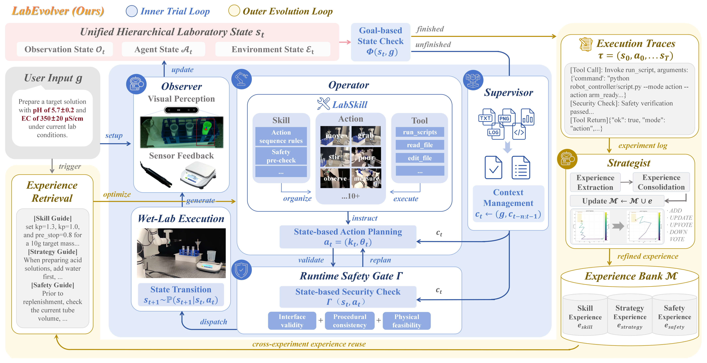
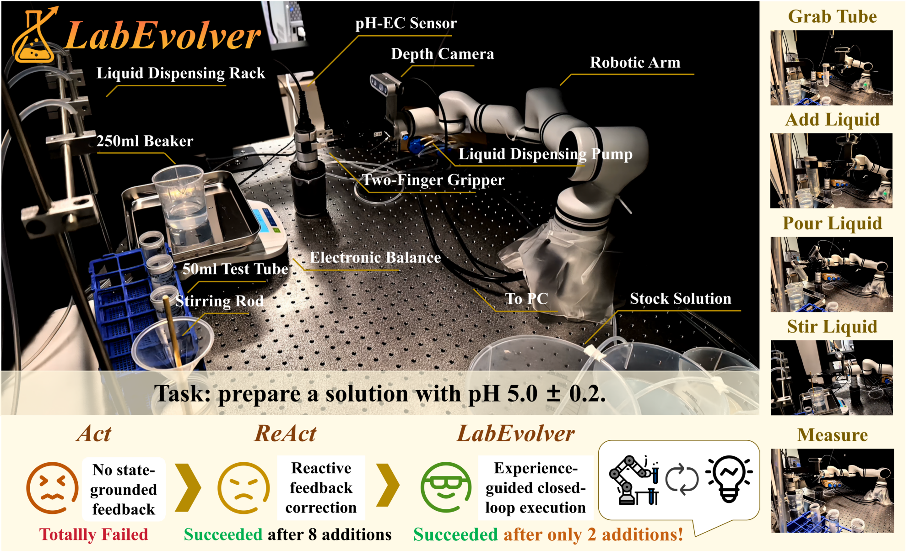
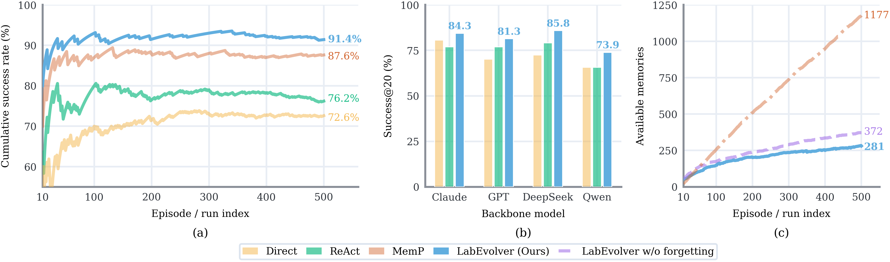
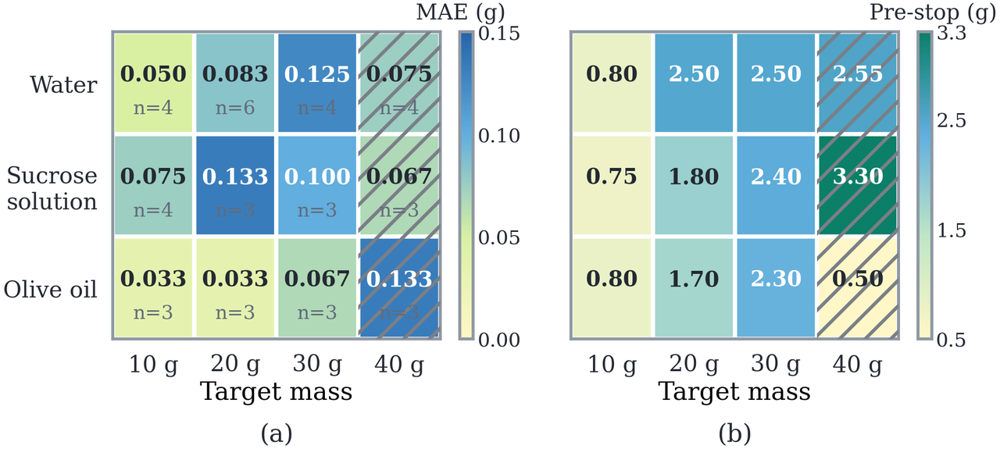
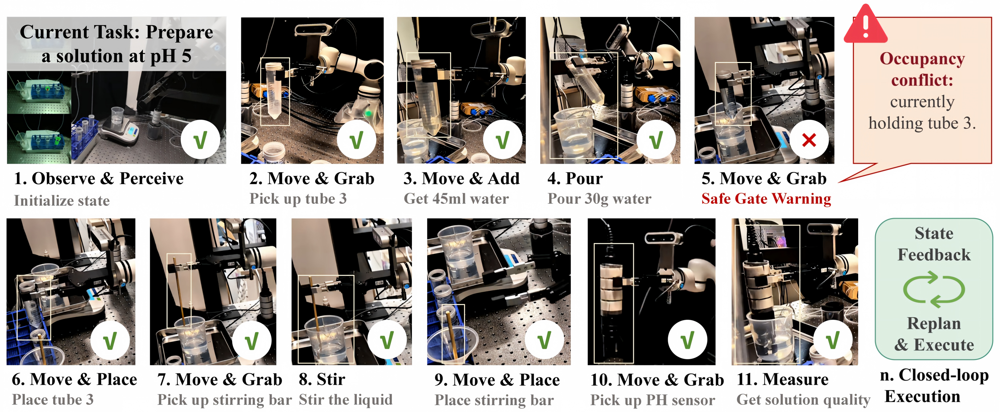
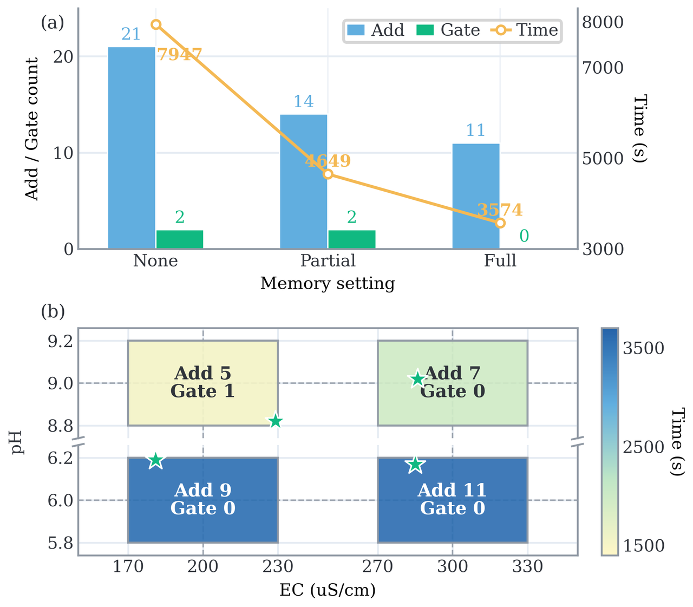

<div align="center">


**Training-Free Experience Evolution for Safe and Grounded Wet-Lab Agents**

[](https://arxiv.org/abs/2607.27690)
[](https://andygao6186.github.io/LabEvolver/)
[](https://opensource.org/licenses/MIT)

*A state-grounded, training-free dual-loop framework that combines safe closed-loop embodied execution with post-trial experience evolution.*

</div>

## 📣 News
- **[Coming Soon]** 💻 The full implementation and evaluation code will be open-sourced soon! Please ⭐ star this repository and stay tuned for updates.
- **[2026.07]** 📄 Our paper is available on [arXiv](https://arxiv.org/abs/2607.27690)! 

---

## 🎥 Video Demonstration

<div align="center">
  <a href="https://andygao6186.github.io/LabEvolver/">
    
  </a>
  <br>
  <em>Watch LabEvolver perform state-grounded, closed-loop wet-lab experiments. Click the preview to visit the project page.</em>
</div>

---

## 📖 Overview

**LabEvolver** equips safe and grounded wet-lab agents with episodic memory from execution experience. We introduce a novel **dual-loop framework**:

1. **Inner Trial Loop 🔄**: Provides adaptive perception, online planning, and safety validation (Tri-layer Runtime Safety Gate) for robust execution.
2. **Outer Evolution Loop 🧠**: Distills completed trajectories into reusable skill-level, strategy-level, and safety-level experience via the *Strategist* module.

<div align="center">
  
</div>

---

## ✨ Hardware Platform & Key Highlights

Our system connects foundation models with real-world physical execution. 

<div align="center">
  
</div>

### 📈 ALFWorld Continual Evaluation
LabEvolver improves training-free long-horizon decision-making. Over 500 continual long-horizon tasks, it improved the cumulative success rate within 20 steps from 76.2% (ReAct) to **91.4%**.

<div align="center">
  
</div>

### 🚰 Transferable Quantitative-Pouring
The framework learns and transfers precise pouring skills across different target masses and liquids (water, sucrose, olive oil) relying purely on physical feedback.

<div align="center">
  
</div>

### 🧪 Closed-Loop pH & Coupled pH–EC Multi-Objective Regulation
In real-world wet-lab environments, LabEvolver reduces pH-regulation completion time by 48.2% and safety-gate intercepts by 60.0%. It also seamlessly handles complex multi-objective interactions (coupled pH-EC) by reusing high-relevance joint trajectory experience.

<div align="center">
  
  <br><br>
  
</div>

---

## 📂 Repository Structure

The current structure hosts our project page and visual assets. The codebase will be structured as follows upon release:

```text
LabEvolver/
├── index.html                   # GitHub Pages project homepage (English/Chinese)
├── assets/
│   ├── images/
│   │   ├── branding/            # Logos and institutional assets
│   │   ├── labevolver/          # Latest paper figures and highlights
│   │   └── ... 
├── core/                        # [Code Coming Soon] Inner trial & outer evolution loop implementation
├── envs/                        # [Code Coming Soon] Interfaces for robotic wet-lab & ALFWorld
└── scripts/                     # [Code Coming Soon] Evaluation and execution scripts
```

---

## 📝 Citation

If you find our work helpful, please consider citing our paper:

```bibtex
@article{wang2026labevolver,
  title={LabEvolver: Training-Free Experience Evolution for Safe and Grounded Wet-Lab Agents},
  author={Wang, Jingya and Gao, Yuyang and Lv, Liuzhenghao and Tian, Yonghong and Liu, Yuyang},
  journal={arXiv preprint arXiv:2607.27690},
  year={2026}
}
```
